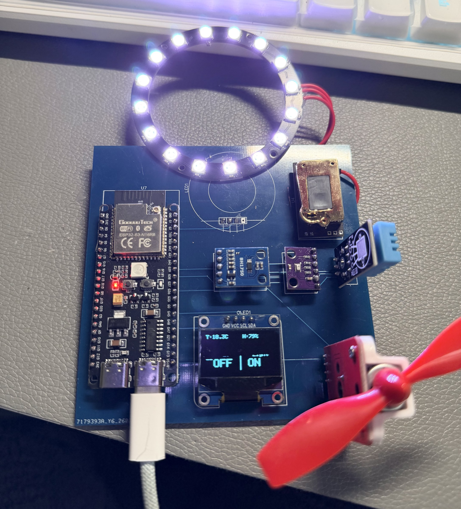

# 基于ESP32-S3和Avalonia的智能农业环境监测系统

> 本科阶段完成的软硬件教学原型。项目包含 ESP32-S3 传感器/OLED 固件，以及 Avalonia/.NET 8 本地桌面数据展示与内置示例数据展示代码，用于学习环境数据采集、桌面界面和受控局域网遥测边界。

[](https://github.com/rongyishuaige7/esp32-s3-smart-agriculture-monitoring-system/actions/workflows/validate.yml)
[](LICENSE)
[](docs/PROJECT_STATUS.md)

> [!CAUTION]
> 这是环境数据展示与软硬件联调教学原型，不是农业自动化产品、可靠告警系统、远程控制系统、安全系统或生产部署方案。传感器数值、OLED、桌面界面、网络请求、CI 或构建成功，都不能证明环境准确、设备在线、命令送达、风扇/补光已动作、作物适宜性、有人处理或电气安全。

## Historical material evidence (2026-07-18 publication)

sanitized historical photo(s), historical EDA derivative(s). See [MEDIA_EVIDENCE](docs/MEDIA_EVIDENCE.md) for dates, sanitization, omissions, and evidence limits.



Historical media/EDA do not prove that the current public commit was flashed or re-tested on hardware. **Current hardware re-test not run.**


## 当前状态与证据边界

| 项目 | 当前事实 |
| :-- | :-- |
| 源码来源 | 桌面原始工程保持只读；本公开仓由隔离候选目录整理，不反向修改原工程。范围见 [SOURCE_PROVENANCE](docs/SOURCE_PROVENANCE.md)。 |
| 公开净化 | 不包含数据库密码、Wi-Fi 凭据、私网地址、压缩源码快照、缓存、IDE 状态、`.NET`/PlatformIO 构建物、桌面发布包、固件二进制、实物照片、视频、原理图、PCB、EDA、Gerber、制造文件或真实运行日志。 |
| 公开默认 | 桌面端不启动 TCP 监听、不发送设备命令且无“设备控制”界面；固件不连接 Wi-Fi/TCP，且 GPIO5、GPIO6、GPIO38 不配置为输出。传感器、I²C、OLED 仍可能初始化；未知外部供电、驱动、上拉和接线仍可能改变实体行为，**不代表无外设 I/O、外部负载已物理关闭或电气安全**。 |
| 网络与控制 | 固件仅有显式编译期 opt-in 的单向教学遥测分支；无下行命令解析、无桌面 TCP listener、无设备身份、TLS、认证、授权、ACK、重放防护或可靠投递语义。默认构建没有网络路径。 |
| 构建 | `SmartAgriculture.sln` 的唯一桌面入口是 `desktop/SmartAgriculture.csproj`；固件提供公开默认、网络遥测 compile-only 与执行器 compile-only 三个隔离构建环境。构建证据见 [VERIFICATION](docs/VERIFICATION.md)。构建不等于烧录、数据库、网络、传感器、OLED、执行器或真机验证。 |
| 当前真机复测 | **未执行**当前公开 commit 的日期化复测。原工程曾运行、旧构建物、代码、CI 或本地构建都不能替代当前公开版本的真机证据。 |
| 公开素材 | 实物照片、演示视频、原理图、PCB、EDA、Gerber、制造文件均为**未提供**；不能由 BOM、SVG、源码、CI 或文字替代。 |

## 公开源码范围

```text
DHT11 / BH1750 / ACD10 / BMP280 / SSD1306
  → ESP32-S3 中的周期性读取与本地 OLED 展示
  → 可选：明确 opt-in 的单向、无认证局域网教学遥测

Avalonia / .NET 8 本地示例数据界面
  → 显示明确标注为“非真机”的环境数据
  → 公开默认不监听网络、不发送命令、不提供设备控制或持久化入口
```

- 温湿度、光照、CO₂ 和气压只是未按当前公开提交真机复测的模块读取路径；零值、界面数值、日志或阈值颜色都不是环境、作物、通风、空气质量、告警或安全结论。
- `ACD10` 代码等待预热；预热、失败、地址、电平和模块行为未在当前公开提交上复测。
- 公开桌面端使用内置示例数据；它不提供真实设备接收、账号、数据库、持久化、迁移、备份、删除、审计或生产数据能力。
- “本地显示阈值”只影响桌面端展示判断，公开默认不会同步给设备，更不会自动控制任何负载。

## 硬件与电气边界

| 模块 / 信号 | 源码接口 | 当前可确认事实 | 实物仍需确认 |
| :-- | :-- | :-- | :-- |
| ESP32-S3 | `esp32-s3-devkitc-1` 构建环境 | PlatformIO 板型配置 | 真实开发板型号、USB、供电与启动脚 |
| DHT11 | GPIO4 | 温湿度读取入口 | 模块电压、上拉、线长、失效读数 |
| BH1750 | I²C GPIO8 / GPIO9 | 光照读取入口 | 地址、供电、总线质量、标定 |
| ACD10 | I²C 常见 `0x2A` | 本地库读取入口与预热逻辑 | 模块型号、电平、预热、准确性、CO₂ 语义 |
| BMP280 | I²C `0x76` | 气压读取入口 | 地址、模块、电平、准确性 |
| SSD1306 OLED | I²C `0x3C` | 本地显示入口 | 屏幕型号、地址、电压、显示效果 |
| GPIO5 / GPIO6 | 风扇驱动信号候选 | 默认设为输入；opt-in 分支也固定低电平 | 驱动器、极性、电流、保护、共地与真实负载 |
| GPIO38 | WS2812B 数据候选 | 默认设为输入；opt-in 分支输出黑色 | 灯带电源、电平、限流、共地与真实行为 |

完整的 [BOM](hardware/BOM.csv)、[源码推导接线边界图](hardware/wiring-diagram.svg)和[硬件说明](HARDWARE.md)不是原理图、PCB、实物接线、制造文件或真机复测证据。断电后再接线；确认实际模块额定电压、电流、电平、供电能力、公共地、驱动与保护。ESP32 GPIO 不得直接驱动风扇、灯带或任何高电流/市电负载。

## 构建与本地教学配置

### 1. 公开门禁（推荐）

```bash
git clone https://github.com/rongyishuaige7/esp32-s3-smart-agriculture-monitoring-system.git
cd esp32-s3-smart-agriculture-monitoring-system
bash scripts/verify.sh
```

脚本在隔离目录中运行公开范围扫描、结构检查、源码契约、`.NET 8` restore/build 和三种 PlatformIO 编译。它不会烧录 ESP32-S3、连接 Wi-Fi、启动 TCP listener、访问真实设备、读取传感器或执行实体动作。

### 2. 桌面端示例数据展示

```bash
dotnet restore SmartAgriculture.sln
dotnet build SmartAgriculture.sln --configuration Release
```

桌面端启动后加载内置示例数据（非真机）；它不会连接数据库、监听网络或发送设备命令。

### 3. 固件公开默认构建

```bash
python3 -m pip install 'platformio==6.1.19'
pio run -d hardware/firmware -e esp32-s3-public-default
```

这只下载上游构建依赖并编译；不会烧录任何设备。公开默认不会连接 Wi-Fi/TCP，也不把 GPIO5、GPIO6、GPIO38 配置为输出。

### 4. 受监督局域网/低压台架 opt-in（未按当前公开提交验证）

```bash
cp hardware/firmware/src/config.local.example.h hardware/firmware/src/config.local.h
# 只在隔离、可信局域网和受监督低压台架中，明确填写本机配置。
# 保持两个实验宏为 0，除非自行完成网络、电气和风险复核。
```

`config.local.h` 被 Git 忽略。只有在使用者本机把 `ENABLE_EXPERIMENTAL_WIFI_TCP` 或 `ENABLE_EXPERIMENTAL_ACTUATORS` 设为精确值 `1` 时，相应 compile-time 分支才会存在。网络 opt-in 仅尝试**单向、无认证**的教学遥测；执行器 opt-in 仍固定让已知输出保持低电平/黑色，不提供自动控制或远程命令。它们不构成设备身份、授权、加密、命令确认、可靠通信、物理动作或电气安全保证。

## 公开范围、验证与反馈

- 公开候选从桌面原始工程单向隔离整理；原目录及其压缩源码快照不被上传、不反向覆盖。
- 当前未公开实物照片、视频、屏幕截图、原理图、PCB、Gerber、制造文件、真实日志、真实传感器数据、Wi-Fi 信息、局域网地址、客户资料。
- 当前 CI 与门禁只验证公开文件边界、源码契约与隔离构建；不验证 ESP32-S3、DHT11、BH1750、ACD10、BMP280、OLED、Wi-Fi、TCP、桌面界面、执行器、电气安全或端到端行为。
- 只有在公开 commit 固定后，才可按 [VERIFICATION](docs/VERIFICATION.md) 填写日期、精确 commit、板型、模块、供电、电平、接线、每项通过/失败及脱敏素材。

详见 [PROJECT_STATUS](docs/PROJECT_STATUS.md)、[SECURITY](SECURITY.md)、[HARDWARE](HARDWARE.md)、[PROTOCOL](docs/PROTOCOL.md) 与 [HARDWARE_LAB_CARD](docs/HARDWARE_LAB_CARD.md)。报告问题时，请不要提交 Wi-Fi 凭据、私网 IP/MAC、数据库配置/导出、真实环境数据、位置、照片 EXIF/GPS、串口日志、网络抓包或其他个人/敏感材料。

## 许可与第三方组件

Rongyi 自有的公开整理代码、文档、BOM 和边界图以 [MIT License](LICENSE) 发布。随源码分发的 ACD10 及构建依赖的归属、许可证和后续二进制分发注意事项见 [THIRD_PARTY_NOTICES](THIRD_PARTY_NOTICES.md)。
